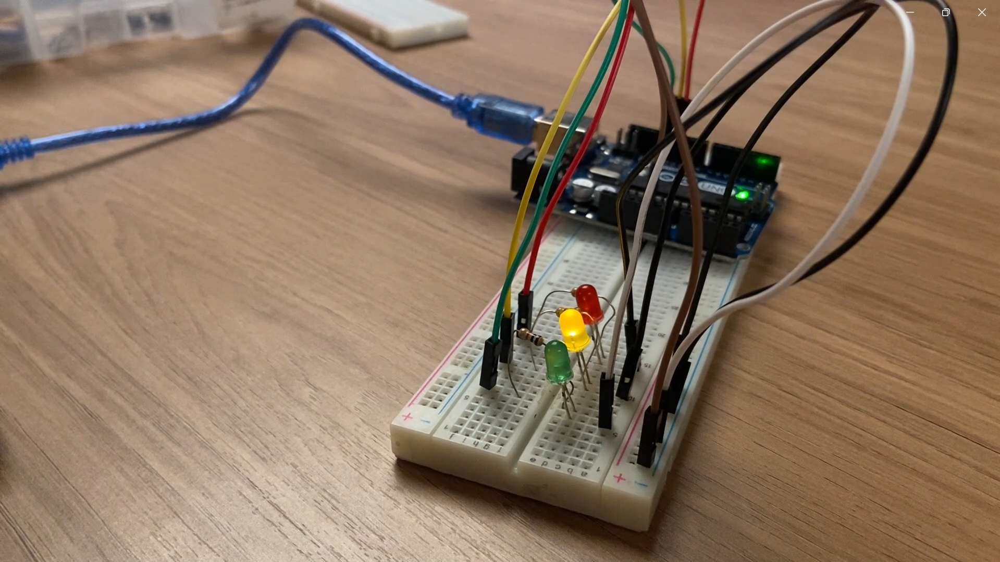

# 🚦 Semáforo Offline
Simulação do circuito de um semáforo utilizando LEDs e resistores com o tinkercad. 

### Montagem física completa


*Figura 1 – Protoboard com LEDs conectados*

### Vídeo demonstrativo

[clique aqui](https://drive.google.com/drive/folders/1DAX-4LIDySAWu2KYjuuTihk8yWYYf-WJ?usp=sharing)

### Relato

Meu ponto de partida para desenvolver o semáforo foi a lógica que aprendi na ponderada da semana 1. 

Com isso, minha primeira ação foi adicionar os três LEDs no circuito, cada um em suas respectivas portas e com os anodos e catodos conectados corretamente. Nesse momento, tentei usar apenas um jumper positivo para fazer a conexão entre arduino e protoboard, assim como é possível no jumper negativo. Mas logo percebi que isso não seria viável, pois cada LED precisa de um fio próprio, já que a conexão deve ser feita diretamente na porta correspondente de cada um.

Após isso comecei a fazer testes com o temporizador para entender como eu poderia coordenar o acionamento dos LED's entre si. Nessas tentativas, percebi que não era necessário utilizar o delay() após desligá-los, bastando definir o delay() apenas para o tempo em que o LED permanece aceso.

Com isso, foi só questão de ajustar o tempo definido na descrição da atividade no Adalove e iniciar a simulação!

### Componentes utilizados

1. Arduino Uno
2. Protoboard
3. Jumpers
4. Led off-board
5. Resistor 220 Ω

### Código

```C

void setup()
{
  pinMode(13, OUTPUT); // configurando o pino 13 como saída p/ verde
  pinMode(12, OUTPUT); // configurando o pino 12 como saída p/ amarelo
  pinMode(11, OUTPUT); // configurando o pino 11 como saída p/ vermelho

}

void loop()
{
  // Vermelho
  digitalWrite(11, HIGH);
  delay(6000); 
  digitalWrite(11, LOW); 
  // Amarelo
  digitalWrite(12, HIGH);
  delay(2000); 
  digitalWrite(12, LOW); 
  // Verde
  digitalWrite(13, HIGH);
  delay(4000); 
  digitalWrite(13, LOW);
  // Amarelo
  digitalWrite(12, HIGH);
  delay(2000); 
  digitalWrite(12, LOW);
}
```

### Circuito 


*Figura 2 – Protótipo montado no Tinkercard*


### Conhecimentos

- Configuração do ambiente de desenvolvimento (Arduino IDE);
- Montagem de um circuito físico;
- Compreenção do uso do setup() para definição de portas e Loop();
- Uso de pinMode(), digitalWrite() e delay() para controlar o LED.

